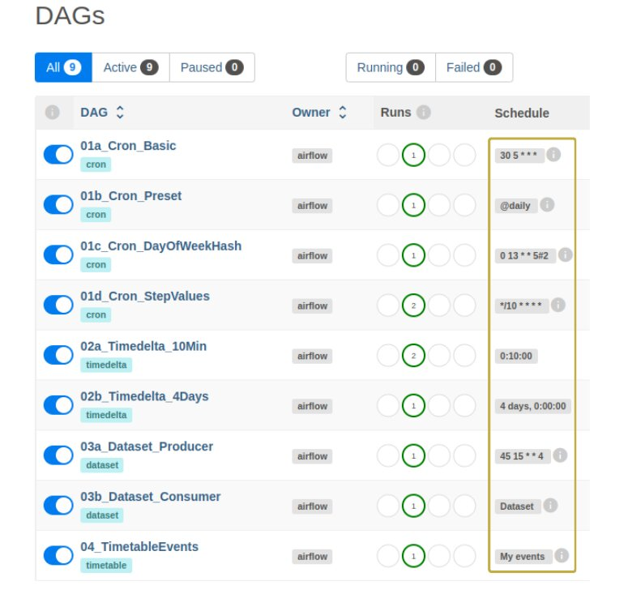

# Airflow Scheduling

**Objective**: This repo demonstrates various methods of scheduling Airflow DAGs. 

Project Start: 2025.01.13

## Architecture
- Technologies Used
  - Apache Airflow
  - Docker - used to run Airflow locally

## Setup Instructions
- Local Setup
  - Download or clone the repository to a local computer. 
- Airflow on Docker
  - The following instructions assume Docker is already installed on the local machine. 
  - In the directory `./airflow_scheduling/` create additional airflow files to be used as volumes by Docker: 
    ```
    mkdir -p ./logs ./plugins ./config
    ```
  - In the directory `./airflow_scheduling/` create a file `.env` by running the following commands: 
    ```bash
    echo -e "AIRFLOW_UID=$(id -u)" > .env    
    ```
    - Docker will automatically pick up this `.env` file when building Airflow resources. 
  - Run the Airflow containers by executing following two commands in a terminal when in the directory `./airflow/`:
    ```bash
    docker compose up airflow-init
    docker compose up
    ```

## How to Run
- After completing setup described above, go to the Airflow UI at `localhost:8080`. Log in with the following credentials:
  - Username: `airflow`
  - Password: `airflow`
- There should be nine dags available defined by the following files. Each DAG features a unique scheduling method:
  - `01_Cron.py`
    - `01a_Cron_Basic`: Standard cron expression
    - `01b_Cron_Preset`: Preset cron expression
    - `01c_Cron_DayOfWeekHash`: Extended cron expression with day-of-week hash
    - `01d_Cron_StepValues`: Extended cron expression with step values
  - `02_Timedelta.py`
    - `02a_Timedelta_10Min`: Timedelta object for every 10 minutes; can be replicated in cron
    - `02b_Timedelta_4Days`: Timedelta object for every 4 days; cannot be replicated in cron
  - `03a_Dataset_Producer.py`
    - `03a_Dataset_Producer`: Standard cron expression; produces a Dataset later consumed by DAG `03b_Dataset_Consumer`
  - `03b_Dataset_Consumer.py`
    - `03b_Dataset_Consumer`: Dataset object updated by DAG `03a_Dataset_Producer`
  - `04_Timetable.py`
    - `04_TimetableEvents`: EventsTimetable object with custom execution dates


